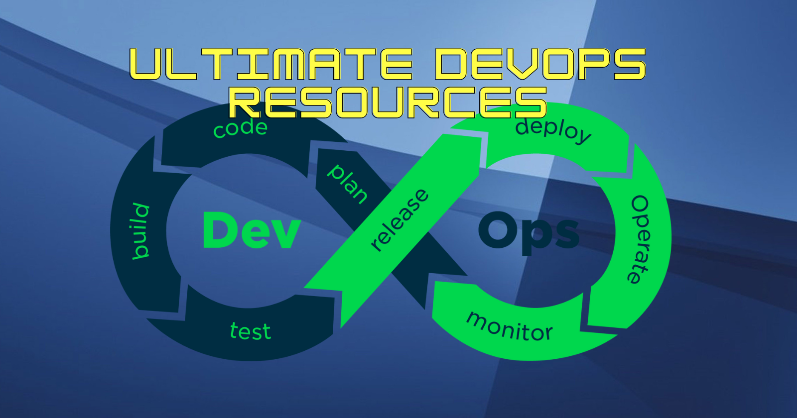

# [Ultimate-DevOps-Resources](https://github.com/DhanushNehru/Ultimate-DevOps-Resources)

  

Welcome to the Ultimate DevOps Resources repository, a curated collection of valuable resources for DevOps enthusiasts. Whether you're a beginner or an experienced practitioner, this repository is your one-stop destination for all things DevOps.

## Contributing

Before you contribute, please review our [CONTRIBUTING](https://github.com/DhanushNehru/Ultimate-DevOps-Resources/blob/main/CONTRIBUTING.md) and [CODE-OF-CONDUCT](https://github.com/DhanushNehru/Ultimate-DevOps-Resources/blob/main/CODE-OF-CONDUCT.md) guidelines to ensure a positive and collaborative experience.

## Table of Contents

- [Ultimate-DevOps-Resources by Dhanush N](https://github.com/DhanushNehru/Ultimate-DevOps-Resources)
  - [What is DevOps](#what-is-devops)
  - [DevOps Tools](#DevOps-Tools)
  - [Free YouTube resources](#free-youtube-resources)
  - [Resources to Learn DevOps](#Resources-to-Learn-DevOps)
  - [Github Repositories for DevOps](#Github-Repositories-for-DevOps)
  - [RoadMap To Learn Devops](#RoadMap-To-Learn-Devops)

## What is DevOps

- Explore the concept of DevOps with [Red Hat](https://www.redhat.com/en/topics/devops).

## DevOps Tools

- [Kubernetes](https://kubernetes.io/)
- [Docker](https://www.docker.com/)
- [Git](https://git-scm.com/)
- [Jenkins](https://www.jenkins.io/)

## Free YouTube Resources

Enhance your DevOps knowledge with these YouTube channels:

- [TechWorld with Nana](https://www.youtube.com/@TechWorldwithNana)
- [Kunal Kushwaha](https://www.youtube.com/@KunalKushwaha)
- [Kubesimplify](https://www.youtube.com/@kubesimplify)
- [FreeCodeCamp](https://www.youtube.com/@freecodecamp)
- [DevOps Directive](https://www.youtube.com/@DevOpsDirective)
- [Hitesh Choudhary](https://www.youtube.com/@HiteshChoudharydotcom)
- [Bret Fisher Docker and DevOps](https://www.youtube.com/@BretFisher)
- [KodeKloud](https://www.youtube.com/@KodeKloud)
- [Simplilearn](https://www.youtube.com/@SimplilearnOfficial)
- [Cloud Advocate](https://www.youtube.com/@CloudAdvocate)
- [Rawkode Academy](https://www.youtube.com/@RawkodeAcademy)
- [Technical Guftgu](https://www.youtube.com/@TechnicalGuftgu)
- [Abhishek.Veeramalla](https://www.youtube.com/@AbhishekVeeramalla)

## Resources to Learn DevOps

### Courses To Learn DevOps

- Enroll in courses to master DevOps:
  - [DevOps Bootcamp by Coursera](https://www.coursera.org/courses?query=devops)
  - [DevOps Fundamentals by Edureka](https://www.edureka.co/blog/devops-tutorial)
  - [DevOps with AWS by Amazon Web Services](https://www.coursera.org/specializations/aws-devops)
  - [DevOps with Azure by Microsoft Azure](https://azure.microsoft.com/en-in/products/devops) 
  - [DevOps with Google Cloud Platform by Google Cloud Platform](https://cloud.google.com/devops)

### Books to Learn DevOps 

- Dive into DevOps literature with these recommended books:
  - [The DevOps Handbook by Gene Kim, Jez Humble, Patrick Debois, and John Willis](https://www.amazon.in/DevOPS-Handbook-World-Class-Reliability-Organizations/dp/1942788002) 
  - [Accelerate: Building and Scaling High Performing Technology Organizations by Nicole Forsgren, Jez Humble, and Gene Kim](https://www.amazon.in/Accelerate-Building-Performing-Technology-Organizations/dp/B07BMCFBWY)

### Blogs to Learn DevOps 

Stay informed with these DevOps blogs:
- [DevOps.com](https://devops.com/) 
- [DZone](https://dzone.com/) 
- [The New Stack](https://thenewstack.io/)
- [The DevOps Guy](https://www.youtube.com/@MarcelDempers)
- [DevOpsCube](https://devopscube.com)
- [DevOps Reddit](https://reddit.com/r/devops)
- [Scott Hanselman's Blob](https://www.hanselman.com/blog)

## Github Repositories for DevOps

- [Awesome scalability](https://github.com/binhnguyennus/awesome-scalability)
- [Awesome cloudnative trainings](https://github.com/joseadanof/awesome-cloudnative-trainings)
- [Devops exercises](https://github.com/bregman-arie/devops-exercises)
- [Fast Kubernetes](https://github.com/omerbsezer/Fast-Kubernetes)
- [Awesome SRE](https://github.com/dastergon/awesome-sre)
- [Awesome Devsecops](https://github.com/devsecops/awesome-devsecops)
- [Devops Bash Tools](https://github.com/HariSekhon/DevOps-Bash-tools)

## RoadMap To Learn Devops

If you're looking to embark on a DevOps journey, follow this comprehensive roadmap:
- [DevOps RoadMap](https://hashnode.com/n/90daysofdevops)

### Basic
- Start with the fundamentals of programming, including Python and Bash.
- Understand the basics of operating systems and networking.
- Learn version control systems, such as Git.
- Familiarize yourself with automation tools like Ansible and Terraform.
- Explore containerization technologies like Docker.
- Dive into cloud computing platforms such as AWS, Azure, and GCP.
- Get a grasp of continuous integration and continuous delivery (CI/CD) practices.

### Intermediate
- Gain practical experience by working on DevOps tools and practices in real-world projects.
- Learn about infrastructure as code (IaC) and configuration management tools like Chef and Puppet.
- Familiarize yourself with monitoring and observability tools like Prometheus and Grafana.
- Explore security and compliance in the DevOps landscape.
- Understand DevOps culture and best practices.

### Advanced
- Delve into site reliability engineering (SRE) principles and practices.
- Learn about chaos engineering and disaster recovery strategies.
- Explore DevOps applications in machine learning and artificial intelligence.
- Embrace DevOps for cloud-native applications.
- Keep up with DevOps for continuous innovation.

## Conclusion

Remember, the DevOps journey is ongoing. There is always more to learn and new technologies to adopt. The key is to start learning and actively engage with the DevOps community.

 

If you find this repository valuable, show your support by starring it. ⭐

 

Thank you for being here and exploring the world of DevOps!
